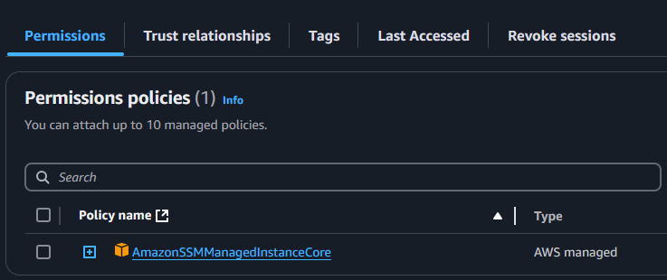

# EC2 secure access with AWS Session manager

Are you fed up with managing a bastion host, managing port permissions and managing ssh keys, managing User private keys and pasting them on several ec2 servers? SAy no to them any more. Now you can use AWS Session manager to log into the ec2 servers without exposing any ports and managing any SSH keys. You jsut need to provide required IAM permissions for the people who require to log into the server.

As the first step we need to setup the EC2 with the SSM agent. To do that we need to assing an instance profile ( A container for an IAM role that you can use to pass role information to an EC2 instance when it is launched ) with the AWS managed permission `AmazonSSMManagedInstanceCore`.

BY doing this, the SSM agnet will be installed in the server automatically, and now the server will be visible in the fllet manager. 