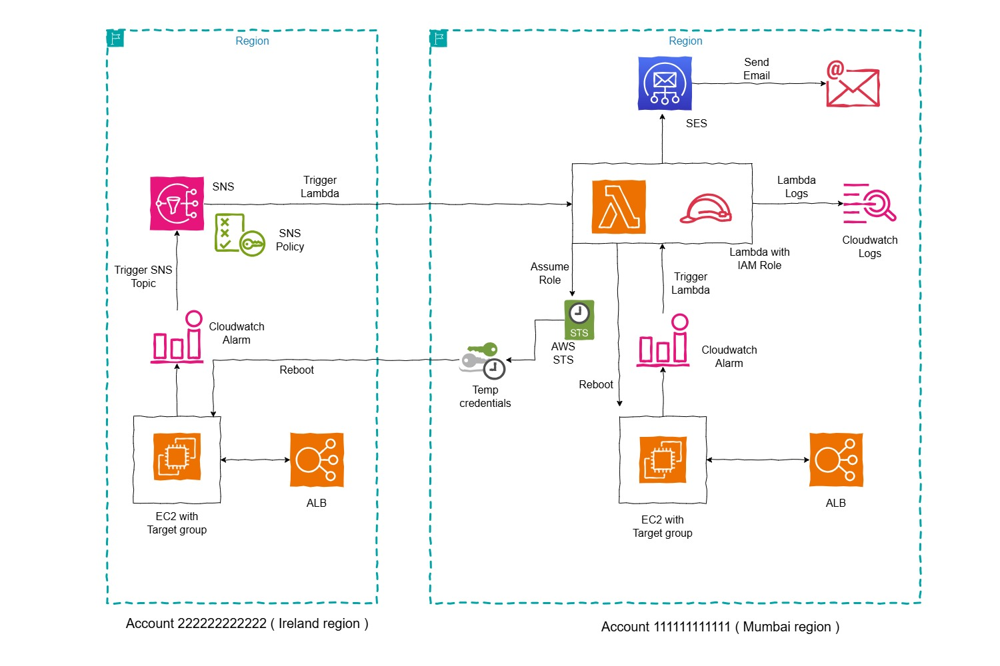
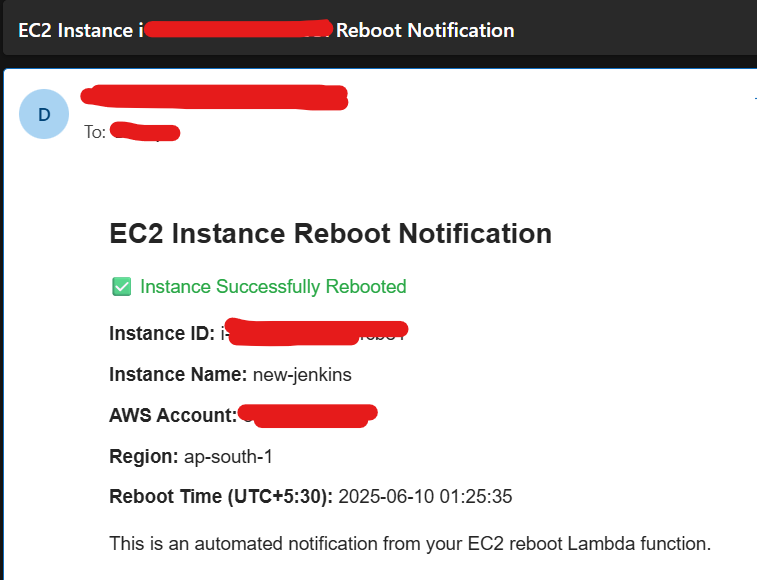

# Automating EC2 Instance Recovery with AWS Lambda: A Cross-Account Solution



## The Problem

Have you ever encountered a situation where your EC2 instance becomes unresponsive due to high memory usage or other issues? In such cases, the instance might remain in a hanging state for hours before auto-recovery kicks in. While auto-scaling groups are great for high availability, sometimes you need to maintain a single EC2 instance for specific use cases. This article presents a solution to automatically reboot EC2 instances when they become unhealthy, even across different AWS accounts and regions.

In this example, we'll use two AWS accounts:
- Account A (111111111111) - Default region: Mumbai (ap-south-1)
- Account B (222222222222) - Default region: Ireland (eu-west-1)

## Why This Solution?

- **Immediate Response**: Instead of waiting for hours for auto-recovery, the instance is rebooted as soon as it's detected as unhealthy
- **Cross-Account Support**: Works across different AWS accounts and regions
- **Automated Notifications**: Sends email notifications when instances are rebooted
- **Cost-Effective**: No need for complex auto-scaling setups when a single instance is sufficient

## Important Cross-Region Limitation

*CloudWatch Alarms only support Lambda targets in the same region. This is because alarm actions must target resources within the same region. So an alarm in Ireland region cannot trigger a Lambda function in Mumbai region. This limitation is enforced by AWS and applies even across accounts. The alarm_actions must point to a Lambda function in the same region as the CloudWatch alarm. Instead of directly triggering the cross-region Lambda, configure the alarm to publish to an SNS topic in Account B, and subscribe the Lambda in Account A to this topic.*

## Prerequisites

This article assumes the following resources and configurations are already in place:

- An EC2 instance, Target Group, and Application Load Balancer (ALB) have been set up.
- Target Group health checks are properly configured.
- CloudWatch alarms are configured for the unhealthy host count metric on the target group.
- Amazon SES is configured, with both the domain and recipient email addresses validated.

## How It Works

The solution uses a combination of AWS services:
1. CloudWatch Alarms to monitor instance health
2. SNS Topics for cross-region communication
3. Lambda function to handle the reboot operation
4. IAM roles and policies for secure cross-account access

"The main components are:
1. A Lambda function that reboots EC2 instances
2. IAM roles and policies for cross-account access
3. Lambda resource based policy creation to be invoked by SNS event and cloudwatch alarm
4. CloudWatch alarm configuration to trigger the Lambda function in the same region same account
5. Create SNS topic in Account B
6. Set the cloudwatch alarm in Account B to point to the SNS topic
7. Grant permission for SNS topic to invoke the lambda in Account A
8. Create a SNS topic subscription in Account A in the same region as SNS topic in Account B

## Implementation Steps

### 1. The Lambda Function

The Lambda function (`lambda_function.py`) is the heart of this solution. It:
- Handles both CloudWatch alarm and SNS events
- Supports cross-account EC2 instance reboots
- Sends email notifications using SES
- Includes comprehensive error handling and logging

Key features:
- Automatic instance name detection from tags
- Support for both instance IDs and IP addresses
- Detailed logging for troubleshooting
- Email notifications with instance details

### 2. Setting Up Cross-Account Access

To enable cross-account operations, we need several IAM components:

1. **Lambda Execution Role** (`lambda_execution_role_policy.json`):
   - Permissions to reboot EC2 instances
   - Ability to assume roles in other accounts
   - SES permissions for sending notifications

2. **Cross-Account Role Trust Policy** (`cross_account_role_trust_policy.json`):
   - Create a Role in Account B (Lets say `EC2RebootRole`) to be assumed by Lambda in Account A
   - Allows the Lambda execution role to assume this role

3. **Cross-Account Reboot Policy** (`cross_account_reboot_policy.json`):
   - Allows EC2 instance reboots in Account B
   - Includes proper resource-level permissions

### 3. Implementation for Cross-Account SNS Topic Subscription

In Account B, create an Amazon SNS Standard topic in the default region (Ireland):

```bash
aws sns create-topic --name sns-topic-for-lambda --region eu-west-1 --profile accountB
```

Grant SNS permission to invoke the function (This will add a resource based policy in Lambda permissions):

```bash
aws lambda add-permission --function-name Function-With-SNS \
    --source-arn arn:aws:sns:eu-west-1:222222222222:sns-topic-for-lambda \
    --statement-id function-with-sns --action "lambda:InvokeFunction" \
    --principal sns.amazonaws.com --region ap-south-1 --profile accountA
```

For the Lambda function in Account A to subscribe to the Amazon SNS topic created in Account B, we need to grant permission for Account A to subscribe to the topic:

```bash
aws sns add-permission --label lambda-access --aws-account-id 111111111111 \
    --topic-arn arn:aws:sns:eu-west-1:222222222222:sns-topic-for-lambda \  
    --action-name "Subscribe" "ListSubscriptionsByTopic" --region eu-west-1 --profile accountB
```

This will add the following permission to the SNS topic access policy:
```json
{
  "Sid": "lambda-access",
  "Effect": "Allow",
  "Principal": {
    "AWS": "arn:aws:iam::111111111111:root"
  },
  "Action": [
    "SNS:Subscribe",
    "SNS:ListSubscriptionsByTopic"
  ],
  "Resource": "arn:aws:sns:eu-west-1:222222222222:sns-topic-for-lambda"
}
```

Total policy is visible in `sample-sns-access-policy.json`.

In Account A, subscribe the Lambda function to the Amazon SNS topic created in Account B:

```bash
aws sns subscribe --protocol lambda \
    --region eu-west-1 \
    --topic-arn arn:aws:sns:eu-west-1:222222222222:sns-topic-for-lambda \
    --notification-endpoint arn:aws:lambda:ap-south-1:111111111111:function:Function-With-SNS \
    --profile accountA
```
**Now this subscription is created in `eu-west-1` region in Account A**.

**Important Note**: The subscription must be created in the region where the SNS topic resides (Ireland). If you use `ap-south-1` in this command, you will receive the error:
`An error occurred (InvalidParameter) when calling the Subscribe operation: Invalid parameter: TopicArn`

**This is because the subscription must be created in the region where the SNS topic resides (Ireland). So always use `--region` to match the correct region of the SNS topic.**

### 4. Testing and Troubleshooting

We tested the Lambda function with sample CloudWatch alarm events and SNS events and addressed several issues:
- Fixed IAM permissions for cross-account access
- Updated the Lambda to correctly parse CloudWatch alarm events
- Ensured proper error handling for missing instance IDs
- Verified the correct principal for CloudWatch to Lambda permissions

## Common Issues and Solutions

1. **UnauthorizedOperation Error**
   - Ensure the cross-account role has correct permissions
   - Check if `ec2:DescribeInstances` permission is properly configured. This permission requires a wildcard resource

2. **InvalidInstanceID.NotFound Error**
   - Verify the instance exists in the specified region
   - Check if the instance ID is correct

3. **Lambda Invocation Issues**
   - Check that the CloudWatch alarm has permission to invoke the Lambda function with the correct principal (`lambda.alarms.cloudwatch.amazonaws.com`).
   - Check SNS topic configuration
   - Ensure all regions and accounts are properly configured.

## Sample Email Response

Following is a sample email response.



## Best Practices

1. Always use proper error handling and logging
2. Implement email notifications for important actions
3. Use resource-level permissions in IAM policies
4. Test the setup in a non-production environment first
5. Monitor Lambda execution logs for any issues

## Conclusion

This solution provides an efficient way to handle EC2 instance recovery across different AWS accounts and regions. It's particularly useful when you need to maintain a single EC2 instance but want automated recovery capabilities. The cross-account and cross-region support makes it flexible for various deployment scenarios.

## References

1. [AWS Lambda with SNS](https://docs.aws.amazon.com/lambda/latest/dg/with-sns-example.html)
2. [CloudWatch Alarms](https://docs.aws.amazon.com/AmazonCloudWatch/latest/monitoring/AlarmThatSendsEmail.html#alarm-states)
3. [CloudWatch Alarms Lambda Invoke Permission](https://repost.aws/questions/QUP2nIYaN9TUu_Htq1WJYXtw/cloudwatch-alarms-is-not-authorized-to-perform-lambda-invokefunction-on-the-resource-because-because-no-resource-based-policy-allows-the-lambda-invokefunction-action)
4. [SNS Cross-Region Delivery](https://docs.aws.amazon.com/sns/latest/dg/sns-cross-region-delivery.html)
5. [Cross-Account Lambda Invocation](https://repost.aws/questions/QUFliBQ20lRIiSjTlkCIrLnA/how-do-i-invoke-a-cross-account-aws-lambda-from-a-cloudwatch-alarm)
6. [Cross-Region CloudWatch Events](https://stackoverflow.com/questions/44787306/can-a-cloudwatch-event-in-one-region-trigger-a-lambda-in-another-region-of-aws)
7. [SNS to Lambda Cross account](https://www.shogan.co.uk/aws/aws-sns-to-lambda-cross-account-setup/)
