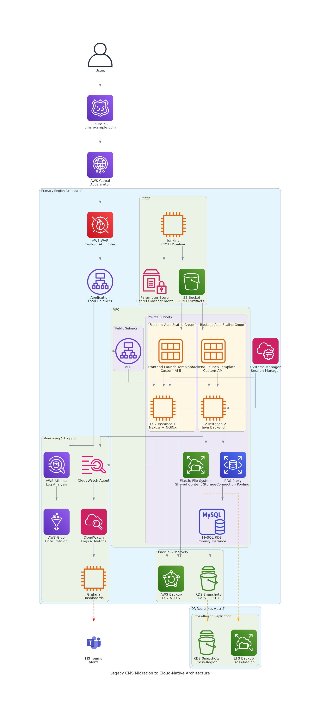
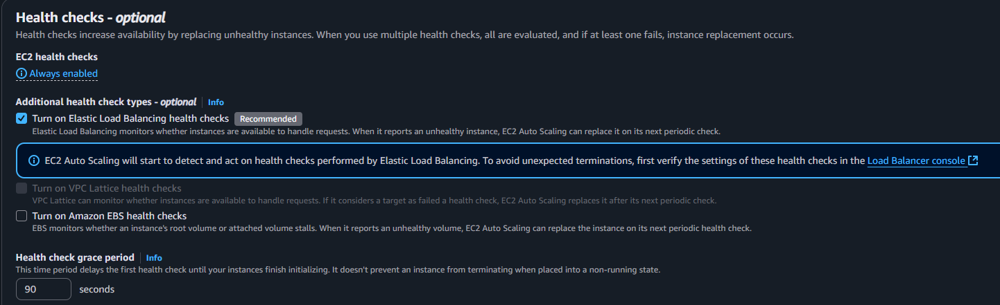
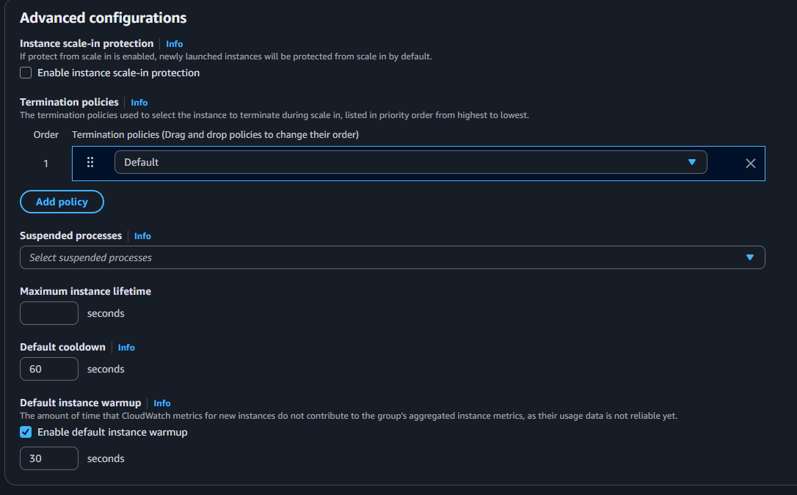
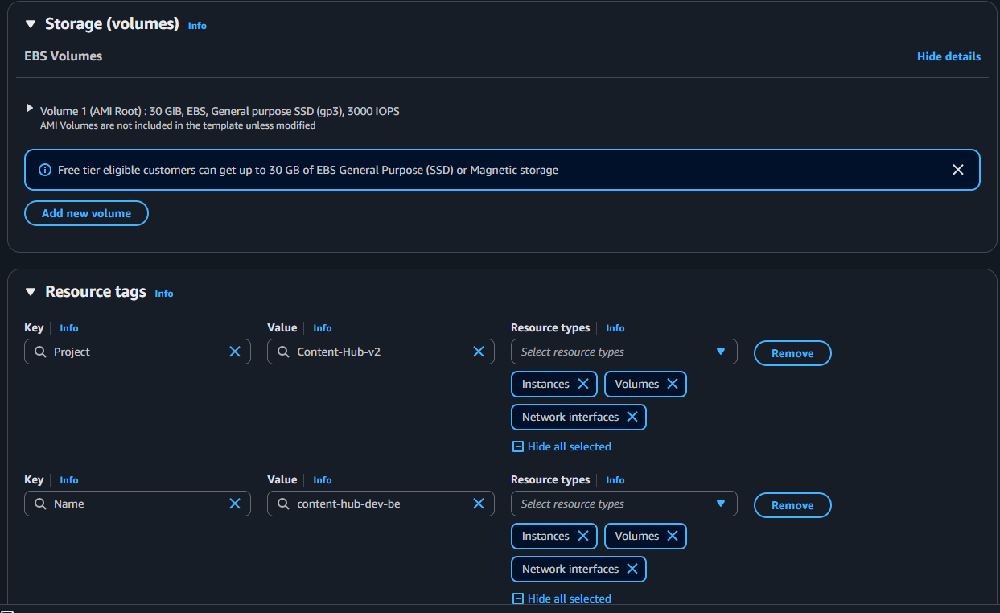

# Legacy System Migration to Cloud-Native Auto-Scaling Architecture

## Project Overview

This project involved migrating a legacy content management system to a modern, cloud-native architecture with automatic scaling capabilities. The system enables users to upload, download, and share content with role-based access controls.

- PHP-written app  
- No databases  
- 1 server for content storage and application hosting 

## New System

- Java backend with Next.js frontend  
- MySQL database

## Architecture Diagram



## Performance and Security Improvements

- **Elastic File System (EFS):** Configured EFS mounts on EC2 instances to provide scalable and shared storage.

   <u>**Why didn't we use S3?**</u>

  1. **Instant access vs. minutes or hours**
   Files in EFS work like those on a regular computer and can be accessed within milliseconds. In contrast, archived objects in S3, especially in Glacier tiers, can take minutes to hours to be available.
  2. **Easy file sharing across EC2 instances**
   EFS can be mounted by multiple EC2 servers at the same time, making it simple and efficient to share files across an Auto Scaling Group.
  3. **No need to rewrite the application or code**
   Our developers expect a real file system where files are stored at a familiar path and accessed with standard file operations. EFS provides this functionality, whereas S3 would require major changes to how the code stores and retrieves files.

- **Data Migration:** Migrated existing data using rsync and AWS DataSync, including cross-region snapshot copying. 
- **Web Application Firewall (WAF):** Enabled with custom ACL rules to enhance security against common web threats.  
- **Logging & Analytics:** Configured AWS Athena and Glue to analyze Application Load Balancer (ALB) logs.  
- **Backup Strategy:** Production EC2 servers and EFS storage are backed up regularly using AWS Backup plans to ensure data durability. Daily RDS snapshots are configured with Point-in-Time Recovery.
- **Disaster Recovery:** EFS storage and RDS snapshots are configured to replicate to a separate region.
- **Secure Access:** Developers can access EC2 servers for urgent issues via AWS Systems Manager Session Manager, eliminating the need for direct SSH access. 
- **Monitoring:** Application logs and additional EC2 metrics are collected with CloudWatch Agent, feeding into dashboards and alerts created in Grafana and CloudWatch. EC2 instance role was configured to access CloudWatch-related data. 
- **Auto Scaling:** Implemented automatic scaling using AWS Auto Scaling Groups (ASG) to dynamically adjust capacity based on demand.
- **Pipeline Secrets:** Stored CI/CD pipeline secrets in AWS Parameter Store and referenced them where necessary.

## Performance Optimization: Addressing System Slowness

- **NGINX Caching:** Implemented server-side caching of static assets to reduce load times and backend processing. (Note: Proof of concept with CloudFront did not meet expectations.)

  **Why CloudFront wasn't suitable for our caching requirements:**

  We needed to optimize thumbnail generation, which involves computationally intensive image processing. Our architecture decision to store thumbnails in EFS (Elastic File System) instead of S3 created a dependency where all media access must route through our backend servers.

  **Technical limitations with CloudFront:**
  - **Architecture constraint:** Since our files are stored in EFS, we must access them through our servers. This would require placing our Application Load Balancer (ALB) behind CloudFront, adding unnecessary complexity.
  - **Timeout restrictions:** CloudFront has a default maximum timeout of 60 seconds for origin requests. Processing requests that exceed this limit results in connection failures.
  - **Quota increase requirements:** To extend the timeout limit, we would need to submit quota increase requests to AWS, which is impractical during iterative testing and development phases.
  - **Content management demands:** Users uploading or downloading large content files often require processing times that exceed CloudFront's standard timeout limits.

- **RDS Relocation:** Moved the RDS instance to the same Availability Zone as the EC2 instances to reduce network latency.  
- **EBS Optimization:** Increased IOPS and throughput on EBS volumes for better disk performance. AWS Compute Optimizer recommendations were also considered here.
- **RDS Proxy:** Added RDS Proxy to improve database connection pooling, reducing overhead and improving connection reliability.
- **AWS Global Accelerator:** Integrated AWS Global Accelerator to enhance application performance and availability by providing a single, static entry point for user traffic and leveraging the AWS global network. This delivers consistently low-latency and reliable connectivity for users worldwide. 
- **EC2 and RDS resizing:** Resized EC2 and RDS instances according to historical performance data.


## Problem Resolution: Timeout Issues

1. **Analyzed ELB logs** using AWS Athena , to identify failure points.
2. **Reviewed Nginx logs** to understand server-side behavior and response times.
3. **Identified problematic endpoints** that were closing connections prematurely.
4. **Increased timeout values** for the specific endpoints that were causing issues.


## Auto Scaling Architecture Design

1. **Inventory Components:**  
   Identify all software components and scripts required on the server, including installations and configurations.

2. **Classify Components:**  
   Separate components into:  
   - *Static* (e.g., Java, Tomcat, AWS CLI) — rarely change.  
   - *Dynamic* (e.g., NGINX server blocks, deployment scripts) — may vary per instance.

3. **AMI Creation:**  
   Build a custom Amazon Machine Image (AMI) containing all static components to ensure consistency across instances.

4. **Launch Template Configuration:**  
   Use the AMI in an EC2 launch template; add dynamic configurations and startup scripts via the `user-data` field.

5. **Auto Scaling Group and Load Balancer:**  
   Create the ASG and associate it with an Application Load Balancer (ALB) target group for traffic distribution and health monitoring.


## Auto Scaling Group Configuration Best Practices

- The cooldown period plus instance warmup effectively defines how long the ASG waits between scaling activities.  
- To replace instances after a fixed time (e.g., 2 days), set the maximum instance lifetime.  
- Create proper health checks:  
  - The Health Check Grace Period of 90 seconds means that after a new instance launches, the ASG waits 90 seconds before starting health checks.  
  - Enable health check types EC2 and ALB. Set the health check endpoint properly in the target group. If a target fails the health check, the ASG will create a new instance to replace that unhealthy EC2. ALB health checks must also be enabled.   
  - You will see activity records like this:  
    ```  
    At 2025-05-27T15:30:25Z an instance was taken out of service in response to an ELB system health check failure.  
    At 2025-05-27T15:42:24Z an instance was launched in response to an unhealthy instance needing to be replaced.  
    ```  
- Advanced configurations as shown:   
- You can add tags to EC2 instances, volumes, and network interfaces by doing the following: 


### CI/CD Pipeline

Check the [Jenkinsfile](Jenkinsfile) for the CI/CD pipeline configuration.


### Migration Checklist: Legacy System to Auto Scaling Setup

#### Preparation

* [ ] List all software and components needed on servers
* [ ] Separate static vs dynamic configurations

#### AMI Creation

* [ ] Install and configure all static components (Java, Tomcat, AWS CLI, etc.)
* [ ] Test the image for stability and correctness

#### Launch Template Setup

* [ ] Create launch template using the custom AMI
* [ ] Add dynamic configurations and deployment scripts to `user-data`
* [ ] Verify network settings, IAM roles, and security groups

#### Auto Scaling Group

* [ ] Create ASG using the launch template
* [ ] Attach ASG to ALB target group
* [ ] Configure health checks (EC2 and ALB)
* [ ] Set cooldown, warmup, and max instance lifetime
* [ ] Define scaling policies (scheduled, based on load, etc.)
* [ ] Add tagging for EC2, volumes, and interfaces

#### Migration

* [ ] Migrate legacy data to new system (rsync, AWS DataSync)
* [ ] Validate data integrity and application functionality

#### Monitoring & Logging

* [ ] Set up CloudWatch agent on instances
* [ ] Configure log collection and metrics
* [ ] Build dashboards and alerts (Grafana, CloudWatch)

#### Security

* [ ] Set up WAF with custom ACL rules
* [ ] Restrict server access via Systems Manager Session Manager

#### Testing & Validation

* [ ] Perform load and failover testing
* [ ] Verify auto scaling triggers and instance replacement
* [ ] Monitor performance and adjust configurations as needed


### Auto Scaling Setup Planning

#### Components to be included in EC2 user-data script

- **Monitoring agent configuration** - Configure CloudWatch agent for metrics collection
- **EFS mount to fstab** - Mount EFS to `/home/ubuntu/data` in fstab for persistence
- **Logging and monitoring JSON creation** - Create CloudWatch logging configuration JSON
- **Nginx server block** - Deploy application-specific server configuration
- **Deployment script** - Create automated deployment script for application updates
- **Start nginx** - Enable and start Nginx service

#### Components to be included in AMI

- **Check Ansible script and install additional packages** - Run existing Ansible playbooks and install additional required tools
- **Java installation** - Install OpenJDK for application runtime
- **EFS installation** - Install Amazon EFS utilities
- **Tomcat installation** - Install Apache Tomcat
- **Tomcat HTTPS config** - Tomcat needs to forward all received requests as HTTPS protocol to the backend application. 
- **Install LibreOffice** - Install LibreOffice for document processing
- **AWS CLI** - Install and configure AWS CLI
- **Logging and monitoring installation** - Install CloudWatch monitoring agent
- **Nginx installation** - Install and configure Nginx proxy
- **Add www-data to ubuntu group** - Configure user group permissions
- **Nginx config** - Configure cache location in EFS mounted point